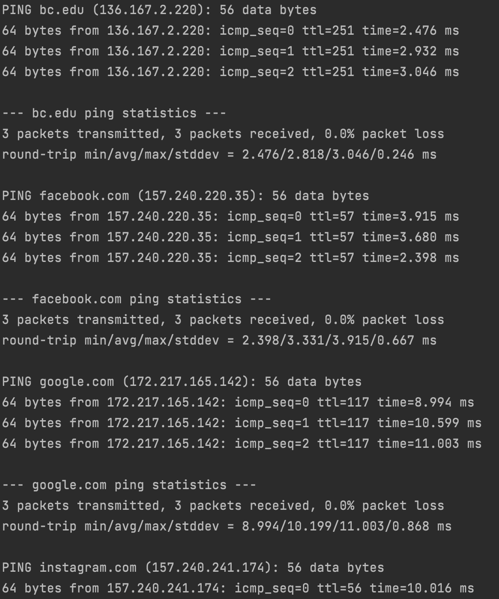
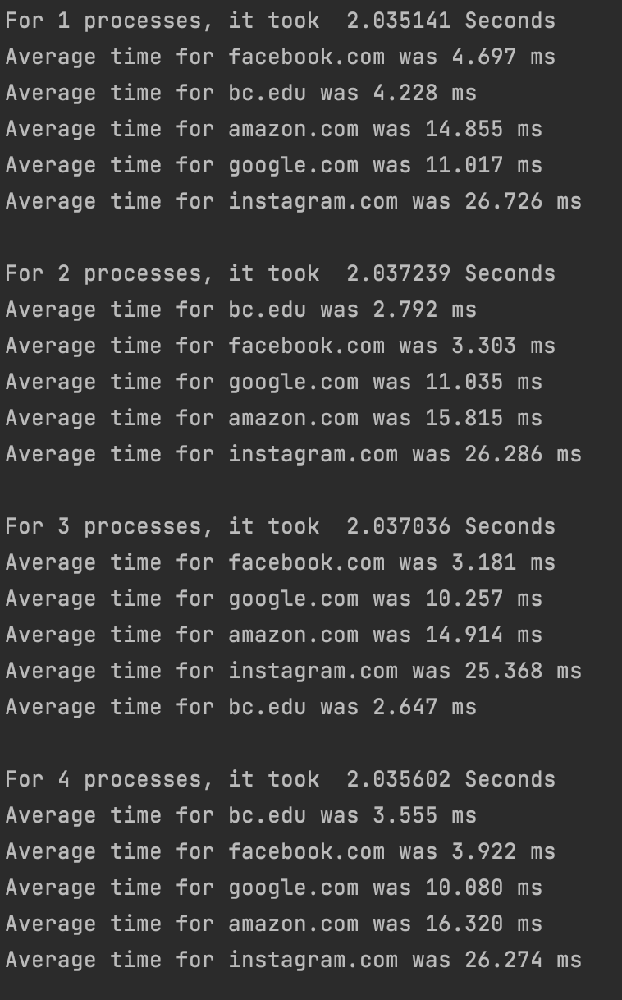
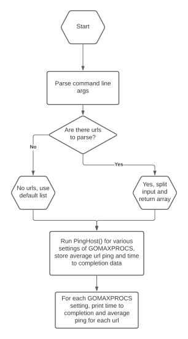

# MP0
This project was created by Matthew Scott, Liam Potts, and Roland Afzelius. It pings websites and prints average response times.

## How to Run
1. Navigate to the folder with main.go, then enter `go run main.go`. 

2. The program will ask for urls. Enter urls in the following format: `google.com`. 
   1. If no urls are entered, a default list will be used containing google, bc.edu, facebook, instagram, and amazon

3. Output is returned to the terminal window. If a url cannot be reached, it will have an error message.

## Design
The program gathers urls, then for values of GOMAXPROCS from 1-8, runs the PingHost() function.
This function iterates over the list of urls and for each, starts a goroutine that pings the server 3 times and returns
command line output through the out channel. We can verify this works in parallel by printing each value that comes through
the channel in turn; the quickest through are printed first while slower ones are printed last, this being inconsistent with
the order in which each goroutine is triggered. 
## Sample Outputs

## Workflow

## References
* Inspiration for running command line prompts in os/exec: https://play.golang.org/p/oCVwgamyNg

* Basic channel usage in concurrency was inspired by this answer: https://stackoverflow.com/questions/36056615/what-is-the-advantage-of-sync-waitgroup-over-channels

* Regexp logic was modified from this thread: https://stackoverflow.com/questions/44516601/capture-result-of-ping-command-in-golang
